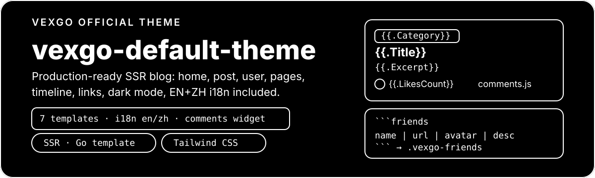

# vexgo-default-theme

<p align="center">
  
</p>

**The official VexGo default theme**: a production-ready, server-side rendered (SSR) blog frontend.

Home feed, post pages, user profiles, custom pages, timeline, links, dark mode, and EN/ZH i18n — all wired up. This is the standalone source repository of the theme built into VexGo, and a good starting point for building your own theme.

> Upstream: [vexgo-org/vexgo](https://github.com/vexgo-org/vexgo) · License: AGPL-3.0

## Contents

- [Pages](#pages)
- [Quick start](#quick-start)
- [Shortcode: friends link cards](#shortcode-friends-link-cards)
- [Special pages: timeline and links](#special-pages-timeline-and-links)
- [Comments, likes, and sharing](#comments-likes-and-sharing)
- [Customization and build](#customization-and-build)
- [Template, style, and i18n cheatsheet](#template-style-and-i18n-cheatsheet)
- [Limitations](#limitations)
- [License](#license)

## Pages

| Route                                           | Template        | Description                                                                             |
| ----------------------------------------------- | --------------- | --------------------------------------------------------------------------------------- |
| `/` (supports `?search=` `?category=` `?page=`) | `index.html`    | Post card feed + categories / popular tags / popular posts / about sidebar + pagination |
| `/post/:slug` (also `/posts/:slug`)             | `post.html`     | Title, author, cover image, rendered Markdown body, likes / comments / share            |
| `/user/:id`                                     | `user.html`     | Avatar, bio, post count + that user's published posts with pagination                   |
| `/<slug>` (e.g. `/about`)                       | `page.html`     | Generic custom page: title + rendered Markdown                                          |
| `/timeline`                                     | `timeline.html` | Dedicated template: year-grouped timeline (rendered client-side from the public API)    |
| `/links`                                        | `links.html`    | Dedicated template: the `friends` shortcode expanded into link cards                    |
| Fallback                                        | `404.html`      | Unmatched routes, draft pages, and missing templates                                    |

Rule: a lowercase, slash-free `<slug>.html` file is the **dedicated template** for the custom page with that slug and takes precedence over `page.html`; routes without a template return 404.

## Quick start

### Site owners: zero install

This theme ships embedded in the VexGo binary — **no installation needed**. Start VexGo and you are already using it.

To ship changes from this repository as a third-party theme:

```bash
bun install
bun run build
```

The build output in `dist/` is plain HTML + CSS + JS (`index.html` / `post.html` / `page.html` / `user.html` / `404.html` / `timeline.html` / `links.html` plus `assets/` + `i18n/` + `seed/`). Add a `vexgo-theme.json` and zip it:

```json
{
  "id": "my-theme",
  "name": "My Theme",
  "version": "1.0.0"
}
```

```bash
cd my-theme && zip -r ../my-theme.zip .
```

Then upload and activate it under **Settings → Theme** in the admin panel (or via the theme upload API). Notes: `id` must match the install directory name and cannot be the reserved word `default`; if set, `preview` must be a full `http(s)` URL.

> Build output goes to `dist/` in this repository. To update the built-in theme in the main repo, copy the contents of `dist/` into `backend/internal/public/default-theme/` (embedded into the binary).

### Seed pages

`seed/timeline.md` and `seed/links.md` are created automatically on theme activation (and on startup) for slugs that do not exist yet — existing pages are **never overwritten**. Frontmatter:

```markdown
---
title: Links
showInNav: true
sortOrder: 101
status: published
---

Page body (Markdown)...
```

`title` defaults to the filename; `showInNav` accepts `true`/`1`; `status` is `published` (default) or `draft`; slugs must match `^[a-z0-9-]{1,100}$`.

## Shortcode: friends link cards

The **only fenced Markdown shortcode** in this theme (and in every VexGo theme). It renders a wall of friend-link cards on **custom pages**.

### Minimal example

In the Markdown body of any custom page (e.g. `/links`):

````markdown
Meet my friends:

```friends
VexGo | https://github.com/vexgo-org/vexgo |  | A self-hosted blog CMS
Example | https://example.com | https://example.com/avatar.png | Example friend link
```
````

This renders a `.vexgo-friends` card wall (styled out of the box here; third-party themes only need the matching CSS).

### Syntax

- The fence markers each occupy their own line: the opening ` ```friends ` (trailing spaces/tabs allowed) and the closing ` ``` `.
- Inside the block, **one line per link** with up to 4 `|`-separated fields:

```text
name | url | avatar | description
```

| Field       | Required | Notes                                                                                                        |
| ----------- | -------- | ------------------------------------------------------------------------------------------------------------ |
| name        | Yes      | Lines with an empty name are skipped                                                                         |
| url         | Yes      | Must be an absolute `http(s)` URL with a host; `javascript:`, relative, and invalid URLs skip the whole line |
| avatar      | No       | Empty shows a round placeholder with the first letter of the name; prefer `https` images                     |
| description | No       | Empty shows the name only                                                                                    |

- Blank lines and `#`-prefixed lines are ignored, so you can group entries with comments:

````markdown
```friends
# CMS
VexGo | https://github.com/vexgo-org/vexgo |  | A self-hosted blog CMS

# Friends
Example | https://example.com |  | Example friend link
```
````

- A page may contain **multiple** `friends` blocks; a block with zero valid rows silently disappears instead of printing source.
- All fields are HTML-escaped, so `<`, `&`, and similar characters are safe.

### Boundaries

- **Custom pages only** (`page.html` / `<slug>.html`, rendered via `RenderPageContent`). **Post bodies do not support** `friends` (safe Markdown rendering shows the fence as a code block).
- Body Markdown runs in safe mode: raw HTML in the source is escaped. Do not hand-write link cards in HTML — the shortcode is the only entry point.
- The card HTML is fixed; themes only provide the styling:

```html
<div class="vexgo-friends">
  <a
    class="vexgo-friend-card"
    href="https://example.com"
    target="_blank"
    rel="noopener"
  >
    
    <!-- Without an avatar: <span class="vexgo-friend-avatar vexgo-friend-initial">V</span> -->
    <span class="vexgo-friend-meta">
      <span class="vexgo-friend-name">VexGo</span>
      <span class="vexgo-friend-desc">A self-hosted blog CMS</span>
    </span>
  </a>
</div>
```

### Troubleshooting

| Symptom                                          | Cause                                                                                                             |
| ------------------------------------------------ | ----------------------------------------------------------------------------------------------------------------- |
| The ` ```friends ` source is visible on the page | It was placed in a **post** instead of a custom page, or the fences are not on their own lines                    |
| One row does not render                          | Empty name, or the URL is not an absolute `http(s)` URL                                                           |
| The whole block disappears                       | Zero valid rows inside (all lines skipped) — expected behavior                                                    |
| Broken styling                                   | Third-party themes missing the `.vexgo-friends` CSS — copy the matching section from this repo's `src/styles.css` |

## Special pages: timeline and links

- **Timeline** (`seed/timeline.md` + `timeline.html`): the body (`{{.Page.ContentHTML}}`) acts as the intro; the `#vexgo-timeline` container below fetches `/api/stats/latest-posts?limit=200` with an inline script and renders year-grouped entries, with `data-loading` / `data-empty` / `data-failed` attributes carrying the translated strings.
- **Links** (`seed/links.md` + `links.html`): body plus the `friends` block expanded server-side; pure SSR, no JavaScript required.

To add your own special page: add `seed/<slug>.md` plus a same-named lowercase `<slug>.html` template (e.g. `about.md` + `about.html`).

## Comments, likes, and sharing

`post.html` wires the self-contained, framework-free comment widget (`widget/comments.js`, copied into the theme's `assets/` at build time with inline styling independent of the theme CSS) in two lines:

```html
<div
  id="vexgo-comments"
  data-post-id="{{.Post.ID}}"
  data-lang="{{.Site.Language}}"
></div>
<script src="/theme-assets/comments.js" defer></script>
```

- `data-post-id` is required (use `{{.Post.ID}}`); without it the widget exits silently.
- `data-lang` is optional with built-in `en` / `zh` strings; unknown languages fall back to English per key.
- Sign-in reuses the admin SPA's `localStorage` session (`token`/`user`), so signed-in visitors can comment directly; a comment can be deleted by its author or by an `admin` / `super_admin`.
- The same script also drives the like button (`<button data-like-post-id="...">` + `[data-like-count]`) and the share button (`<button data-share-url="...">` + `[data-share-hint]`); without JavaScript they degrade to static counts.

## Customization and build

```text
vexgo-default-theme/
├── src/
│   ├── templates/      # React sources: Home / Post / Page / User / NotFound / Timeline / Links
│   ├── components/     # SiteLayout (header/footer/dark-mode toggle), icons
│   ├── lib/go.ts       # go(): emits Go template actions verbatim as strings
│   └── styles.css      # Tailwind + .vexgo-friends / .vexgo-timeline styles
├── widget/comments.js  # Comment/like/share widget source
├── i18n/en.json zh.json# Theme dictionaries (files use normalized codes, e.g. zh.json)
├── seed/               # timeline.md / links.md default pages
└── scripts/generate.tsx# renderToString pass that emits the Go-template HTML
```

Key constraints (from the backend renderer — read before editing templates):

- `src/templates/*.tsx` are **sources**, the generated files are the theme: `go("...")` emits `{{...}}` verbatim, executed by the backend as Go templates. **Expressions inside HTML attributes must not contain double quotes** (React escapes them to `&quot;`); use helpers such as `userURL` / `categoryURL` / `searchURL` instead of hand-built URLs.
- Static files live in `assets/` and templates always reference `/theme-assets/<file>` (the server adds the `assets/` segment — never write `/theme-assets/assets/...`).
- All root `.html` files are parsed into **one shared template set** where `{{define}}` blocks are visible across files, parsed in filename order; a syntax error in any file blocks theme activation.
- Dark mode is purely a theme concern: toggling the `dark`/`light` class on `<html>` plus `localStorage.theme` (shared key with the admin panel); there is no backend switch.

Common commands:

```bash
bun install
bun run build     # typecheck + Tailwind + emit Go-template HTML
bun run generate  # emit HTML only (most used while iterating on markup/styles)
```

## Template, style, and i18n cheatsheet

- Template data: `.Site` (`.Site.Language` is the resolved visitor language) / `.Posts` / `.Post` (`.Post.ContentHTML` is the pre-rendered body — emit unescaped) / `.Page` (`.Page.ContentHTML`, same, including the `friends` expansion) / `.User` / `.Pages` (navigation) / `.Pagination` / `.Query` / `.PopularPosts` / `.PopularTags`, plus the eight helpers `date` / `truncate` / `first` / `add` / `userURL` / `categoryURL` / `searchURL` / `t`. Field-level details live in the main repo's `docs/reference/theme-templates.md`.
- i18n: flat `i18n/<lang>.json` dictionaries used via `{{t "nav.home"}}`; resolution chain `?lang=` → `vexgo_lang` cookie → `Accept-Language` → site default → `en`, with per-key fallback (missing keys render as the key itself). Supporting a new language is one additional JSON file.
- Header/footer: `SiteLayout` provides the search box, navigation (home + `.Pages`), the language switcher (`?lang=zh|en`), the sign-in state button (reads `localStorage.token`), and the footer.

## Limitations

- Templates are Go `html/template`: only the data and helpers above are available — no database access, filesystem access, or arbitrary function calls.
- Every page must be a complete HTML document with no layout inheritance; share markup via `{{define}}` / `{{template}}`.
- Content is server-rendered safe Markdown: raw HTML is escaped, and themes must not re-render `ContentHTML`.
- Theme ZIP upload limits: 32 MiB archive, 100 MiB / 2000 files unpacked, 10 MiB per file.

## License

[GNU Affero General Public License v3.0](LICENSE). Keep the license notice when redistributing the theme.
